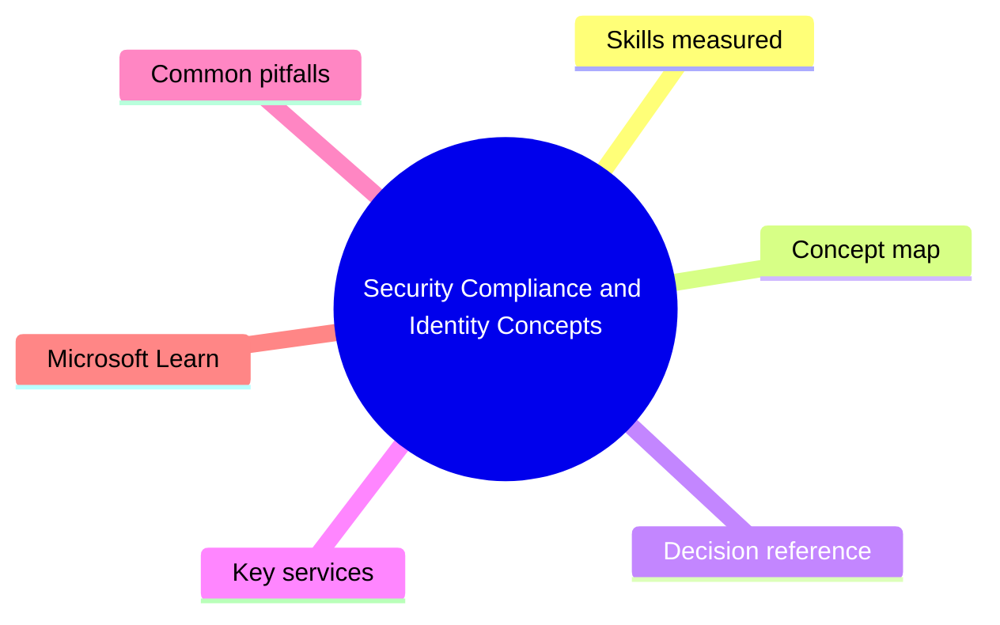
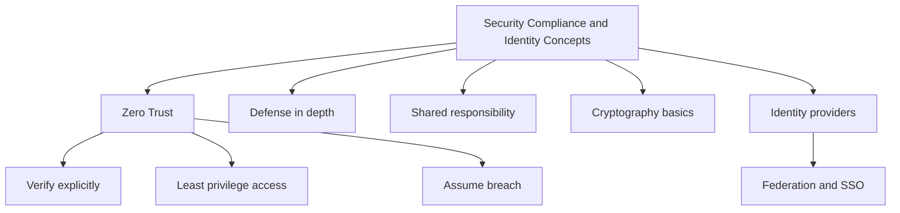

# Security Compliance and Identity Concepts

> Domain 1 of SC-900. Weight: 12%.

## Domain mind map

## Skills measured

- Define the Zero Trust security model and its guiding principles
- Define defense in depth and the shared responsibility model
- Describe common threats: phishing, malware, ransomware, DDoS
- Describe encryption, hashing, and signing at a high level
- Define identity as the new security perimeter
- Describe authentication, authorization, and federation

## Concept map

## Decision reference

| When you see... | Pick... | Why |
|---|---|---|
| On-prem datacenter is fully my responsibility | All controls customer-owned | Shared responsibility shifts left as you move to IaaS/PaaS/SaaS |
| Need symmetric vs asymmetric crypto example | AES symmetric, RSA asymmetric | Symmetric for bulk data, asymmetric for key exchange |
| App requires non-repudiation | Digital signature (hash + private key) | Signing proves the sender and integrity |
| Trust no one by default | Zero Trust | Verify explicitly, least privilege, assume breach |

## Key services

- **Microsoft Entra ID** - Cloud identity and access management
- **Microsoft Defender** - XDR family for prevention and response
- **Microsoft Purview** - Compliance, data governance, eDiscovery
- **Microsoft Sentinel** - Cloud-native SIEM/SOAR

## Common pitfalls

- Confusing authentication (who you are) with authorization (what you can do)
- Thinking encryption alone replaces access control
- Treating Zero Trust as a product instead of a strategy
- Forgetting that SaaS still has customer responsibilities (data, identities, endpoints)

## Microsoft Learn

- [Describe the concepts of security, compliance, and identity](https://learn.microsoft.com/training/paths/describe-concepts-of-security-compliance-identity/)
- [Zero Trust adoption framework](https://learn.microsoft.com/security/zero-trust/)
- [Shared responsibility in the cloud](https://learn.microsoft.com/azure/security/fundamentals/shared-responsibility)

---

[<- Master Index](00-MASTER-INDEX.md) | [Master Index](00-MASTER-INDEX.md) | [Microsoft Entra Capabilities ->](02-microsoft-entra.md)
