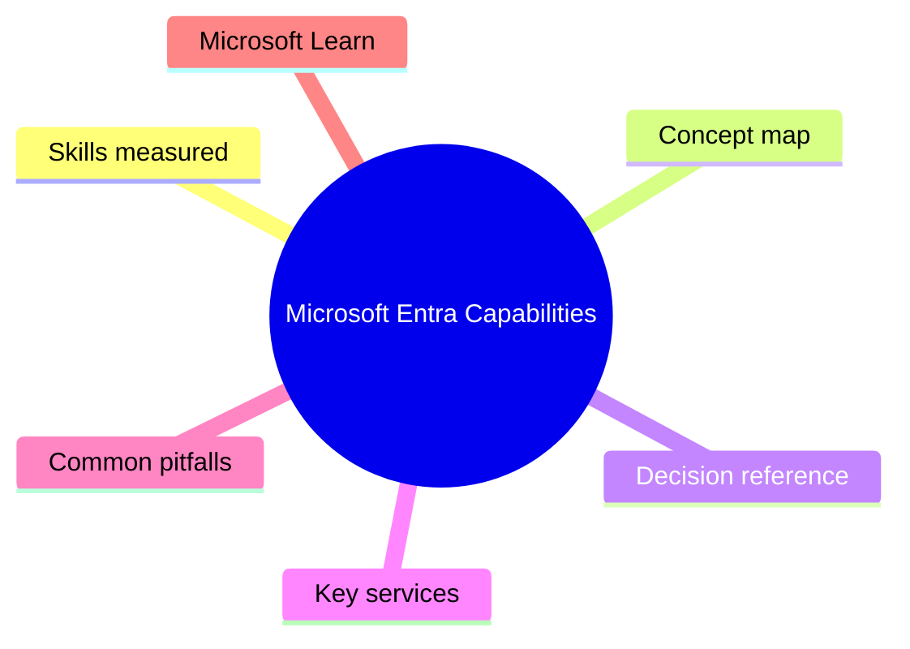
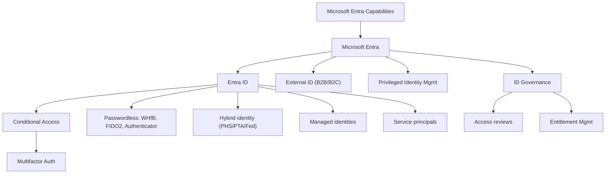

# Microsoft Entra Capabilities

> Domain 2 of SC-900. Weight: 28%.

## Domain mind map

## Skills measured

- Describe Microsoft Entra ID (formerly Azure AD) and its editions
- Describe identity types: user, device, service principal, managed identity
- Describe hybrid identity options (PHS, PTA, federation)
- Describe authentication methods: passwords, MFA, passwordless (Windows Hello, FIDO2, Authenticator)
- Describe Conditional Access, Identity Protection, and PIM
- Describe Entra ID Governance: access reviews, entitlement management, lifecycle workflows
- Describe External ID for B2B/B2C scenarios

## Concept map

## Decision reference

| When you see... | Pick... | Why |
|---|---|---|
| App needs Azure RBAC without secrets | System-assigned managed identity | Eliminates credential storage; lifecycle tied to resource |
| On-prem app needs cloud SSO | Entra App Proxy or hybrid join | Brings legacy apps into modern auth without VPN |
| Block sign-in from risky countries | Conditional Access named-location policy | CA evaluates signals at sign-in |
| Just-in-time admin access | Privileged Identity Management (PIM) | Time-bound, approval-gated role activation |
| Customer-facing app with social logins | Microsoft Entra External ID for customers | Replaces Azure AD B2C for new tenants |
| Sync passwords to cloud | Password Hash Sync (PHS) | Simplest hybrid auth; supports leaked-credential detection |

## Key services

- **Entra ID Free / P1 / P2** - P1 adds CA + groups, P2 adds Identity Protection + PIM
- **Entra Connect / Cloud Sync** - Bridges on-prem AD to Entra ID
- **Microsoft Entra Verified ID** - Decentralized identity for verifiable credentials
- **Microsoft Entra Permissions Management** - CIEM for AWS/GCP/Azure
- **Microsoft Entra Workload ID** - Conditional Access for service principals + MIs

## Common pitfalls

- Assuming Entra ID is just renamed Azure AD with no new features (it is the umbrella for many ID products)
- Forgetting Identity Protection and PIM require P2 licensing
- Confusing a service principal (per-tenant app instance) with an app registration (the app definition)
- Using federation when PHS would suffice (added complexity for no benefit in most cases)

## Microsoft Learn

- [Describe the capabilities of Microsoft Entra](https://learn.microsoft.com/training/paths/describe-capabilities-of-microsoft-identity-access/)
- [Conditional Access overview](https://learn.microsoft.com/entra/identity/conditional-access/overview)
- [PIM documentation](https://learn.microsoft.com/entra/id-governance/privileged-identity-management/)
- [Entra ID Governance](https://learn.microsoft.com/entra/id-governance/)

---

[<- Security Compliance and Identity Concepts](01-security-concepts.md) | [Master Index](00-MASTER-INDEX.md) | [Microsoft Security Solutions ->](03-microsoft-security.md)
