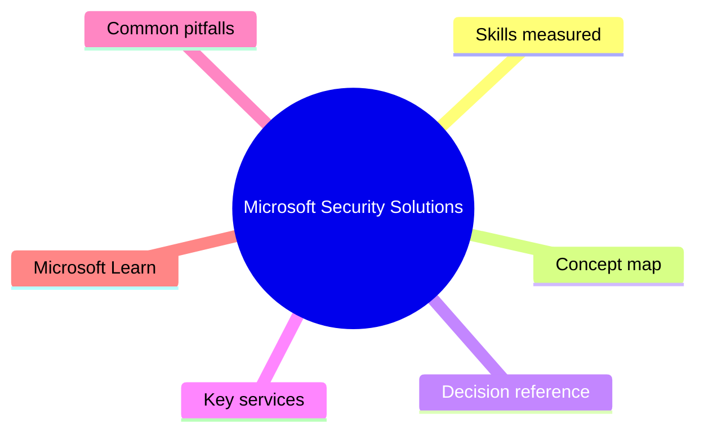
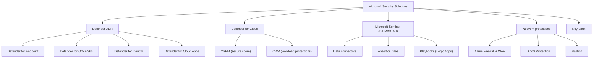

# Microsoft Security Solutions

> Domain 3 of SC-900. Weight: 38%.

## Domain mind map

## Skills measured

- Describe Microsoft Defender XDR (formerly 365 Defender) and its workloads
- Describe Defender for Endpoint, Office 365, Identity, Cloud Apps, and Cloud
- Describe Microsoft Sentinel: data connectors, analytics rules, hunting, SOAR
- Describe Defender for Cloud: secure score, regulatory compliance, workload protections
- Describe Azure DDoS Protection, Azure Firewall, Web Application Firewall, Bastion
- Describe Network Security Groups, Azure Key Vault, Azure Disk Encryption

## Concept map

## Decision reference

| When you see... | Pick... | Why |
|---|---|---|
| Need EDR + AV on Windows endpoints | Defender for Endpoint (P1 or P2) | P2 adds EDR, automated investigation, threat & vuln mgmt |
| Phishing protection for Exchange Online | Defender for Office 365 (P1 anti-phish, P2 Threat Explorer + AIR) | Native to Exchange Online + Teams |
| Lateral movement detection on-prem | Defender for Identity | AD agent on DCs, profiles user behavior |
| Discover shadow IT SaaS apps | Defender for Cloud Apps (CASB) | Log analysis + app catalog of 31k apps |
| Multi-cloud posture (Azure+AWS+GCP) | Defender for Cloud CSPM | Single secure score across clouds |
| Centralize logs from all sources for hunting | Microsoft Sentinel | Cloud SIEM, KQL, automated playbooks |
| Block volumetric L3/L4 attack on public IP | Azure DDoS Protection (Network or IP plan) | Always-on telemetry + cost protection |
| Filter HTTP attacks (SQLi, XSS) | Web Application Firewall on Front Door / App Gateway | Layer-7 OWASP managed rules |
| Secure VM admin without exposing RDP/SSH publicly | Azure Bastion | TLS over port 443 from the portal |
| Store TLS cert privately | Azure Key Vault (Standard or Premium HSM) | Centralized secret/cert/key management |

## Key services

- **Defender XDR portal** - Unified SecOps portal at security.microsoft.com (now also hosts Sentinel)
- **Microsoft Sentinel** - PAYG SIEM in a Log Analytics workspace
- **Defender for Cloud** - CSPM + CWP across Azure/AWS/GCP/on-prem
- **Azure Firewall** - Stateful, managed L3-L7 firewall (Standard/Premium)
- **Azure WAF** - L7 WAF on Front Door or App Gateway
- **Azure Key Vault** - Secrets, keys (HSM-backed in Premium), certificates

## Common pitfalls

- Confusing Defender for Cloud (Azure resources) with Defender XDR (M365 + endpoints)
- Forgetting Sentinel ingestion is paid by GB; analytics rules + retention add up fast
- Assuming NSGs are stateful firewalls (they are filters, not WAFs - no L7 inspection)
- Thinking Bastion replaces JIT VM access - they complement each other

## Microsoft Learn

- [Describe security solutions of Microsoft](https://learn.microsoft.com/training/paths/describe-capabilities-of-microsoft-security-solutions/)
- [Microsoft Sentinel overview](https://learn.microsoft.com/azure/sentinel/overview)
- [Defender for Cloud documentation](https://learn.microsoft.com/azure/defender-for-cloud/)
- [Microsoft Defender XDR](https://learn.microsoft.com/defender-xdr/)

---

[<- Microsoft Entra Capabilities](02-microsoft-entra.md) | [Master Index](00-MASTER-INDEX.md) | [Microsoft Compliance Solutions ->](04-microsoft-compliance.md)
