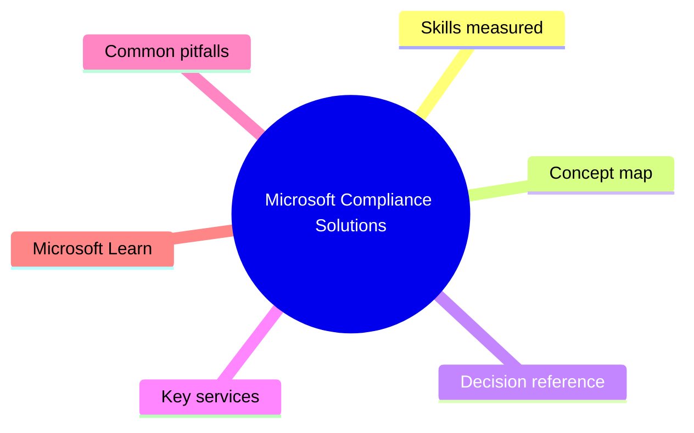
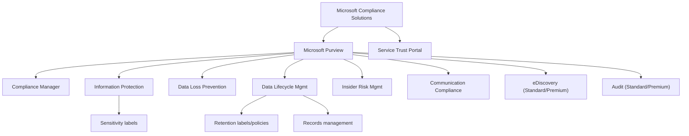

# Microsoft Compliance Solutions

> Domain 4 of SC-900. Weight: 22%.

## Domain mind map

## Skills measured

- Describe Microsoft Purview (compliance portal, data governance)
- Describe Compliance Manager and compliance score
- Describe sensitivity labels, DLP, retention labels and policies
- Describe insider risk management, communication compliance, eDiscovery, audit
- Describe Service Trust Portal and Microsoft Privacy principles

## Concept map

## Decision reference

| When you see... | Pick... | Why |
|---|---|---|
| Need to classify a document automatically | Sensitivity label with auto-labeling | Uses trainable classifiers or sensitive info types |
| Block sharing of credit card numbers in Teams | DLP policy with PCI-DSS template | Out-of-the-box SIT for credit card numbers |
| Keep emails for 7 years then delete | Retention policy in Data Lifecycle Management | Time-based with disposition action |
| Investigate a leaving employee for IP theft | Insider Risk Management policy | Triggers on resignation + data exfil signals |
| Hold mailboxes for litigation | eDiscovery (Premium) hold + case | Premium adds review sets, predictive coding |
| Show auditors my regulatory progress | Compliance Manager assessment | Templates for HIPAA, GDPR, ISO 27001, etc. |
| Download Microsoft SOC 2 report | Service Trust Portal | Audit reports, pen tests, white papers |

## Key services

- **Microsoft Purview compliance portal** - purview.microsoft.com - unified compliance UI
- **Compliance Manager** - Templates + improvement actions + score
- **Microsoft Priva** - Privacy management built on Purview
- **Purview Data Map / Catalog** - Enterprise-wide data governance (broader than M365)

## Common pitfalls

- Assuming sensitivity labels and retention labels are the same (one is for protection, the other for lifecycle)
- Confusing eDiscovery Standard vs Premium - Premium adds review sets, predictive coding, holds beyond mailboxes
- Forgetting that DLP can act on Exchange, SharePoint, OneDrive, Teams, AND endpoints (with Endpoint DLP)
- Treating the Service Trust Portal as a customer compliance tool - it is just Microsoft attestation reports

## Microsoft Learn

- [Describe compliance management capabilities of Microsoft](https://learn.microsoft.com/training/paths/describe-capabilities-of-microsoft-compliance-solutions/)
- [Microsoft Purview](https://learn.microsoft.com/purview/)
- [Compliance Manager](https://learn.microsoft.com/purview/compliance-manager)
- [eDiscovery in Microsoft Purview](https://learn.microsoft.com/purview/ediscovery)

---

[<- Microsoft Security Solutions](03-microsoft-security.md) | [Master Index](00-MASTER-INDEX.md) | [Cheatsheet ->](05-exam-cheatsheet.md)
