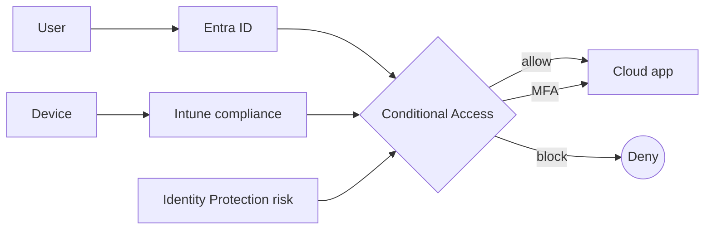
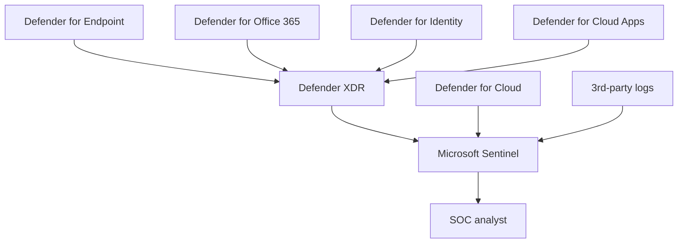

# Architectures - SC-900

> Reference architectures you should be able to draw on a whiteboard for the exam.

## Zero Trust signal flow

## Defender XDR + Sentinel

---

[Master Index](00-MASTER-INDEX.md)
